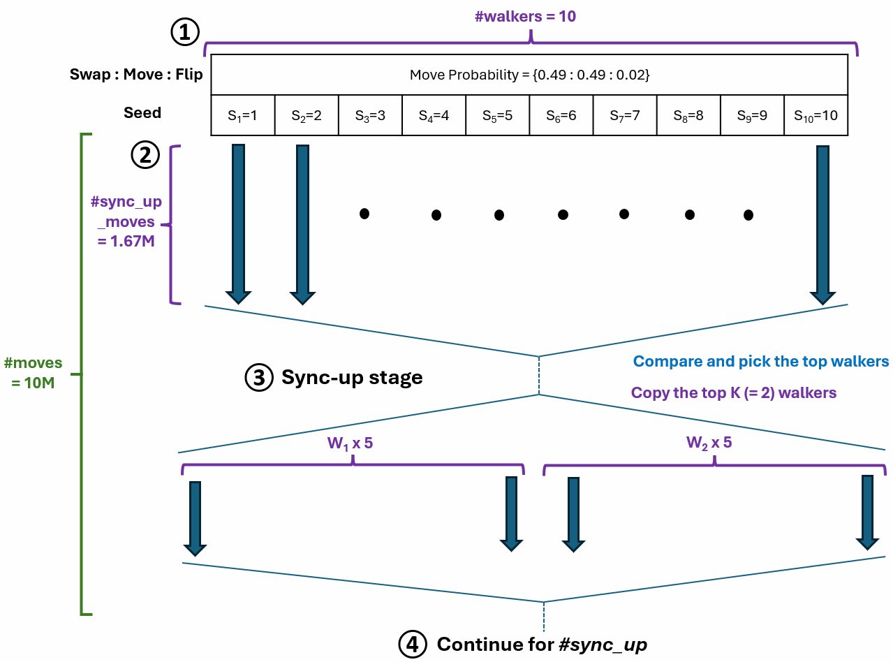

# Simulated Annealing-Based 1D Placement Optimization
We use simulated annealing (SA) combined with the “go-with-the-winners” (GWTW)
approach (Aldous and Vazirani, 1994) to solve the 1-D placement problem. For our
SA implementation, we define three moves: (i) [swapping two cells](./src/Worker.cpp#L230): randomly
selecting two cells and swapping them; (ii) [shifting a cell](./src/Worker.cpp#L308): shifting a cell to a
new location; and (iii) [flipping a cell](./src/Worker.cpp#L481): mirroring a cell about the Y-axis.
We adjust the cell locations between the two cells during a swap or between
the initial and final positions during a move to ensure there is no overlap.

## Usage
We have enabled the following Tcl commands to run the placement optimization:
```tcl
# Read SA parameters from JSON file
setSAParams -json_file <json_file>

# Run SA-based 1D placement optimization
opt_sa_1d

# Report Packed HPWL
report_pack_hpwl
```

We also provide a [sample JSON file](./test/setSAParam.json) and a [sample Tcl script](./test/run_openroadSA.tcl) to run SA-based 1-D placement optimization. After installing OpenROAD, you can simply run the following command to run the placement optimization on the sample design:

```bash
# Provide OpenROAD binary full path
openroad -no_gui -script run_openroadSA.tcl -log <log_file>
```

Here are the details of the parameters that can be set in the JSON file:
| Parameter      | Default Value | Description                                                                                              |
|----------------|---------------|----------------------------------------------------------------------------------------------------------|
| move_budget (#moves)         | \(10^7\)      | Total number of moves to be performed                                                                   |
| max_iter (#iterations)    | 1000          | Distinct temperatures in the annealing schedule                                                         |
| max_temp       | \(10^6\)      | Starting temperature                                                                                    |
| min_temp       | \(10^-3\)      | Ending temperature                                                                                      |
| cooling_rate   | 0.97949       | Geometric cooling factor: \((\text{min_temp} / \text{max_temp})^{(1/\#\text{iterations})}\)              |
| move_probs     | [0.49, 0.49, 0.02] | Probability of selecting each move (swap, move, flip) probabilities                                 |
| seed           | 1             | Seed used for random number generation                                                                 |
| (num_workers) #walkers       | 20            | The number of parallel SA walkers                                                                      |
| #sync_up       | 5             | Total number of sync-ups among the SA (sync_freq = 1/(1+#sync_up))walkers                                                          |
| #top_k         | 2             | During synchronization, the top \#top_k SA walkers based on HPWL are replicated and evenly distributed among \#walkers |

## Go-With-The-Winners (GWTW) Flow
Example parameter values and flow description  
- *#moves* = 10M  
- *#sync_up* = 5  
- *#iterations* = 1000   
- *#walkers* = 10  
- *#top_k* = 2  
- *move_probs* = [0.49, 0.49, 0.02]  
- *sync_iter* = #iterations / (#sync_up + 1) = 1000 / (5 + 1) = 166.667  
- *#moves_per_iteration* = #moves / #iterations = 10M / 1000 = 10000  
- *#sync_up_moves* = sync_iter * #moves_per_iteration = 1.67M  

(1) Assign a different seed to each walker  
(2) Run walkers in parallel for *#sync_up_moves* (= 1.67M), randomly selecting a move type among swap, move, and flip based on *move_probs* (= [0.49, 0.49, 0.02])  
(3) After 1.67M moves, compare the costs of walkers, select the top *#top-k* (= 2) walkers, and copy them 5 times (= *#walkers* / *#top-k*)  
(4) Repeat steps (2) and (3) for *#sync_up* (= 5) times, reaching a total move count of *#moves* (= 10M)  

|  |
|:--:|

## Testcase
We provide three artificial testcases for test
| Testcase      | #insts |   #PIs   |   #POs   |  comb_ratio   |   avg_fanin   |
|---------------|--------|----------|----------|----------|---------------|
| Testcase1     |  50 |    7   |    5   |   0.93   |   2.3   |
| Testcase2     | 100 |   16   |   22   |   1.00   |   5.4   |
| Testcase3     | 210 |   30   |   30   |   0.83   |   3.6   |

Placed DEF files of each testcase are provided
- Testcase1: SAIT-1D-Placer/src/sa1d/test/defs/testcase1/ArtNet.def
- Testcase2: SAIT-1D-Placer/src/sa1d/test/defs/testcase2/ArtNet.def
- Testcase3: SAIT-1D-Placer/src/sa1d/test/defs/testcase3/ArtNet.def

How to run SA with GWTW using user-created DEF
```tcl
# Edit 'run_openroadSA.tcl' located in SAIT-1D-Placer/src/sa1d/test
# Set design name for 'top_module'
set top_module {DESIGN_NAME}
# Set DEF path for 'def_dir'
set def_dir "{DEF_PATH}"
# Set DEF file name
read_def ${def_dir}/{DEF_file}.def

# Run SA-based 1D placement optimization
./run_sa.sh
```
